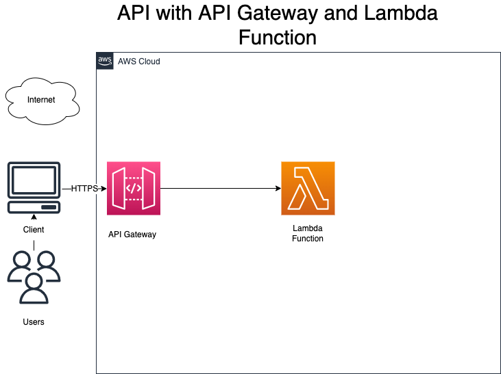

# API with API Gateway and Lambda (python)

### Application diagram



#### Features
1. WSGI handler with lambda - allow same lambda serving multiple paths
2. Tracing with XRay
3. Variable injection (from env file)
4. Dockerizing deployment package creation
5. Deployment bucket


#### Deployment

Dependency installation

```npm install```

Deployment 

```sls deploy --stage dev```

Destroy

```sls remove --stage dev```