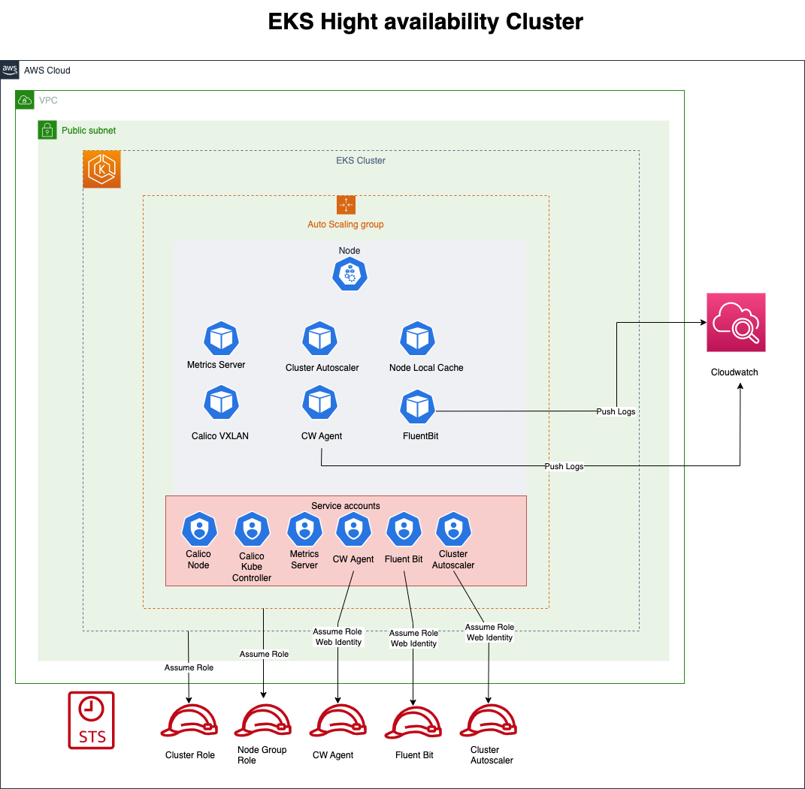

# High Availability Cluster

### Features:
1. Calico VXLAN - to minimize ip usage on VPC. Calico will allow deploying pods without limits on VPC ip's
2. CW Agent - allow ec2 instance logs injection to Clouwdwatch
3. Fluent Bit - application logs injection to Cloudwatch
4. Metrics server - to enable monitoring on cluster, to be used on application HPA
5. Cluster autoscaler - allow cluster autoscaling
6. Node local cache - to allow address caching, to minimize DNS resolution time, in case node scales to multiple nodes.


### Example diagram




### Deployment

#### Prerequisites
1. add in env backend.tfvars with the following vars
region = ""
bucket = ""
key = ""
dynamodb_table = ""
2. add dev.tfvars
cluster_name = ""
account = ""
region = ""
subnets = []
vpc_id = ""
launch_template = ""
ami = "eks optimized ami"
keypairname = ""


#### Terraform Init
```terraform init --backend-config=./env/backend.tfvars```

#### Validation of configuration

```terraform validate```

#### Deployment plan

```terraform plan -var-file=./env/dev.tfvars -detailed-exitcode -out=plan```

#### Apply plan
```terraform apply plan```

#### Destroy plan

```terraform plan -destroy -var-file=./env/dev.tfvars -detailed-exitcode -out=plan```

#### Destroy

```terraform apply -destroy plan```
